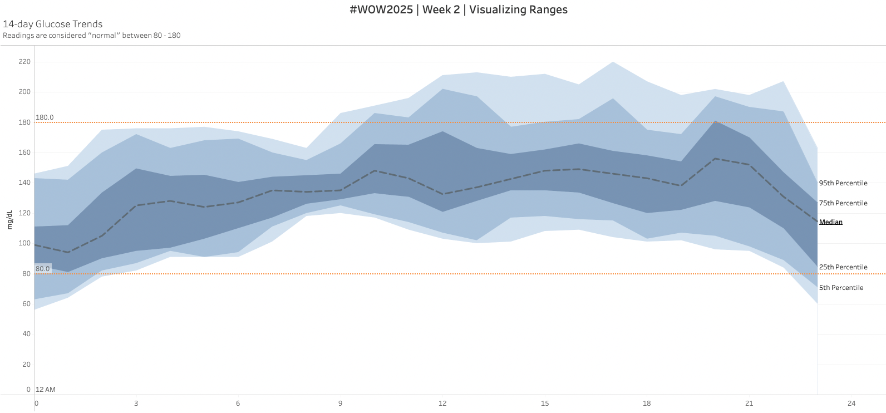

# WOW2025 | Week 2 | Visualizing Ranges

This repository contains my submission for **Workout Wednesday 2025 | Week 2 | Visualizing Ranges**. The challenge was to recreate an interesting visualization involving percentile ranges, median values, and reference bands in Tableau. Below are the details of the project.

---

## :bar_chart: Dashboard Overview

The Tableau Dashbboard Visualizes hourly data points of Glucose readings over a 14-day period with the following features:
- **Percentile Ranges**:
    - 5th Percentile
    - 25th Percentile
    - 75th Percentile
    - 95th Percentile
- **Median Level**: Represented as a dashed line
- **Normal Range**: Shown as a dotted band indicating the range of 80 to 180
- **Layered Shading**: To visually translate the percentile ranges

---

## 🛠 Requirements

### Challenge Criteria:
 - Dashboard size: **1300 x 600**
 - Created on a single sheet in Tableau
 - Properly Layered and shaded percentile ranges
 - Reference band for "normal" range with dotted lines

 ### Tools Used:
 - **Tableau Public** for dashboard creation
 - Dataset containing hourly glucose measurements

 ### **Tableau Dashboard**
 The interactive Tableau Dashboard is published on Tableau Public. You can view it here:
 [Tableau Dashboard Link](https://public.tableau.com/app/profile/harrison.reed8543/viz/WOW2025Week2VisualizingRanges_17374005494500/Sheet1?publish=yes)

